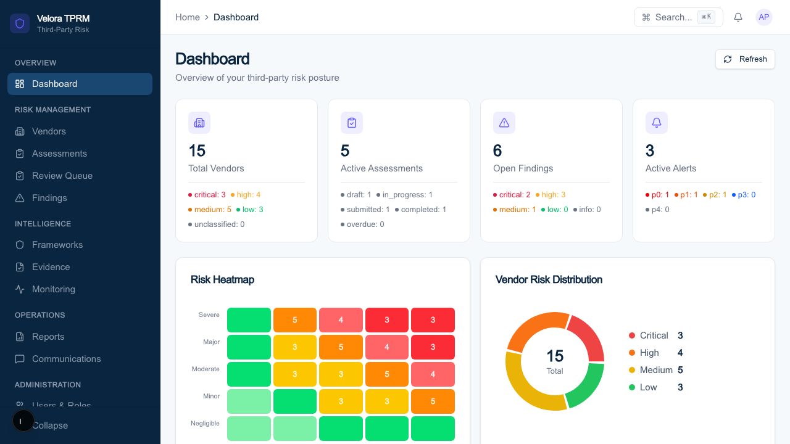
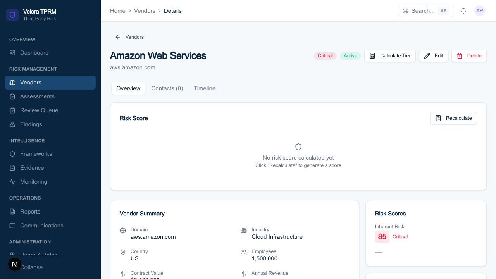

<div align="center">

# Velora TPRM

**Open-source, AI-native Third-Party Risk Management**

[](https://github.com/DevamShah/velora-tprm/actions/workflows/ci.yml)
[](https://github.com/DevamShah/velora-tprm/actions/workflows/codeql.yml)
[](https://scorecard.dev/viewer/?uri=github.com/DevamShah/velora-tprm)
[](LICENSE)
[](pyproject.toml)
[](frontend/web/package.json)

[Why](#why) · [Screenshots](#screenshots) · [Architecture](#architecture) · [Quick start](#quick-start) · [Development](#development) · [Contributing](CONTRIBUTING.md)

</div>

---

## Why

Third-party risk management is mostly a document-shuffling job. A vendor sends
a 300-question SIG spreadsheet and a SOC 2 PDF. An analyst spends two days
reading both, transcribes the answers into a GRC tool, maps them to whichever
framework the auditor cares about this quarter, and files it. Twelve months
later the whole thing repeats, and nobody has looked at the vendor in between.

The work that actually reduces risk — deciding whether a control gap matters
for *this* vendor at *this* tier holding *this* data — gets whatever time is
left over.

Velora inverts that. The reading, extraction, mapping, and first-pass scoring
are automated. Evidence documents are parsed and mapped to controls with a
confidence score. Questionnaires are pre-populated from prior responses and
uploaded evidence, then queued for human review rather than human authorship.
Monitoring runs continuously instead of annually. The analyst reviews and
decides; the platform does the transcription.

**Who this is for:** TPRM, GRC, and security teams carrying a few hundred to a
few thousand vendors, who need to move faster than questionnaire round-trips
allow without giving up the audit trail a regulator will ask for.

**What it is not:** a hosted SaaS. This is the full platform source under
AGPL-3.0 — run it yourself.

## Screenshots



<details>
<summary>Vendor 360 detail view</summary>



</details>

## What it does

**Vendor lifecycle** — inventory with bulk CSV import, AI enrichment
(firmographics, ratings, certifications), configurable four-tier inherent risk
classification, and a 360-degree profile with contacts, timeline, and scores.

**Assessment engine** — framework-aware questionnaires (SIG Core/Lite, CAIQ v4,
custom), AI pre-population from prior responses and evidence, and a review
queue where a human confirms or overrides every AI answer.

**Evidence parsing** — SOC 2 reports, ISO certificates, and pen test reports
are parsed, extracted, and mapped to controls with per-mapping confidence and
coverage type (full / partial / supportive).

**Framework intelligence** — four frameworks ship seeded with 74 clauses:
SOC 2 Type II, ISO 27001:2022, NIST CSF 2.0, and HIPAA. A cross-framework
mapping engine means one answer satisfies every framework that asks the same
question, and the control library is extensible for frameworks you add.

**Risk quantification** — configurable multi-dimensional scoring plus FAIR
Monte Carlo simulation (10K iterations) producing Annual Loss Expectancy with
percentile ranges, so risk can be discussed in currency rather than colours.

**Continuous monitoring** — multi-signal ingestion with P0–P4 alert
classification, 24-hour deduplication, and 48-hour correlation that escalates
clustered mid-severity signals rather than burying them.

**Reporting** — executive dashboard, and board-ready PDF/PPTX generation with
generated narrative summaries.

**Platform security** — multi-tenant PostgreSQL Row-Level Security, RBAC and
ABAC enforced by OPA policy-as-code, AES-256-GCM field-level PII encryption
with HMAC lookup hashes, and an immutable audit trail.

## Architecture

```
                           +------------------+
                           |   Next.js SPA    |
                           |   (React 19)     |
                           +--------+---------+
                                    |
                           +--------+---------+
                           |  BFF Service     |
                           | (sessions, agg)  |
                           +--------+---------+
                                    |
                    +---------------+----------------+
                    |       Traefik API Gateway       |
                    +--+--+--+--+--+--+--+--+--+--+--+
                       |  |  |  |  |  |  |  |  |  |
         +-------+  +--+--+ +--+--+ +--+--+ +--+--+  +--------+
         | auth  |  |vendor| |assess| |score | |frame|  |evidence|
         | :8001 |  |:8002 | |:8003 | |:8005 | |:8004|  | :8006  |
         +-------+  +------+ +------+ +------+ +-----+  +--------+

         +--------+ +------+ +------+ +------+ +-----+  +--------+
         |monitor | |finding| |comms | |report| |admin|  |  ai    |
         | :8007  | |:8008  | |:8009 | |:8010 | |:8011|  | :8012  |
         +--------+ +-------+ +------+ +------+ +-----+  +--------+
                                    |
                    +---------------+----------------+
                    |       Shared Infrastructure     |
                    | PostgreSQL | Redis | Temporal   |
                    | MinIO | OPA                     |
                    +--------------------------------+
```

14 services over REST and Redis Streams, long-running processes orchestrated by
Temporal, every request authorized by OPA.

| Service | Port | Purpose |
|---------|------|---------|
| auth-service | 8001 | Authentication, SSO/OIDC, JWT sessions |
| vendor-service | 8002 | Vendor lifecycle, contacts, enrichment |
| assessment-engine | 8003 | Questionnaires, templates, lifecycle |
| framework-service | 8004 | Compliance frameworks, clause mapping |
| scoring-engine | 8005 | Risk scoring, FAIR, portfolio aggregation |
| evidence-service | 8006 | Upload, parse, control mapping |
| monitoring-service | 8007 | Signals, alerts, rules engine |
| finding-service | 8008 | Findings, remediation tracking |
| communication-hub | 8009 | Notifications, email, Slack/Teams |
| reporting-service | 8010 | Dashboards, PDF/PPTX generation, CQRS |
| admin-service | 8011 | Users, roles, audit logs, configuration |
| ai-service | 8012 | LLM orchestration, RAG, auto-fill |
| workflow-service | 8013 | Temporal workers |
| bff-service | 8000 | Backend-for-frontend, session management |

Deeper detail lives in [`docs/hld.md`](docs/hld.md), [`docs/lld.md`](docs/lld.md),
and [`docs/architecture/`](docs/architecture/).

## Quick start

**Prerequisites:** Docker with Compose v2. For local (non-container)
development you also need Python 3.12+ and Node.js 20+.

```bash
git clone https://github.com/DevamShah/velora-tprm.git
cd velora-tprm
cp .env.example .env
```

Bring it up with the Makefile:

```bash
make infra       # postgres, redis, minio
make core        # the 8 core risk services
make frontend    # BFF (:8000) + web app (:3000)
```

Or start everything at once:

```bash
make all         # core + comms + reporting + admin + ai + workflow + frontend
```

Then open <http://localhost:3000>. `make help` lists every target;
`make down` stops the stack and `make clean` also drops the volumes.

Seed the demo dataset — 15 vendors, 5 assessments, 4 frameworks with 74
clauses, plus alerts and findings:

```bash
make db-migrate
make db-seed
```

**Demo credentials** (seed data only — these exist solely in your local
database and are not valid anywhere else):

| Email | Password | Role |
|-------|----------|------|
| admin@velora-demo.com | admin123 | Admin |
| analyst@velora-demo.com | analyst123 | Risk Analyst |

API docs are served at <http://localhost:8000/docs> (Swagger) and
<http://localhost:8000/redoc>.

## Development

Run the backend and frontend outside containers against containerised
infrastructure:

```bash
make infra

# Backend (monolith mode — single app, shared DB)
cd src/backend
python3.12 -m venv .venv && source .venv/bin/activate
pip install -r requirements.txt
alembic upgrade head
uvicorn app.main:app --reload --port 8000

# Frontend
cd frontend/web
npm install && npm run dev
```

Individual services run via `make run-auth`, `make run-vendor`, and so on —
one target per service.

Checks:

```bash
make lint        # ruff across every service
make fmt         # ruff format
make test        # pytest
```

## Project structure

```
velora-tprm/
├── packages/velora-common/   Shared library — auth, events, OPA client, models
├── services/                 The 14 microservices
├── frontend/web/             Next.js dashboard and vendor portal
├── src/backend/              Monolith mode, used for local development
├── src/frontend/             Frontend source used by CI
├── policies/                 OPA Rego policies — tenant isolation, route access
├── infra/                    Docker, Traefik, database init
├── docs/                     PRD, HLD, LLD, architecture, research
└── tests/                    QA checklists and scenarios
```

## Tech stack

| Layer | Technology |
|-------|-----------|
| Backend | Python 3.12 / FastAPI |
| Frontend | Next.js 15 / React 19 / TypeScript |
| UI | shadcn/ui + Radix UI + Tailwind CSS |
| Database | PostgreSQL 16 — RLS, schema-per-service |
| Cache / events | Redis 7 Streams |
| Authorization | Open Policy Agent |
| Workflows | Temporal.io |
| Gateway | Traefik |
| Object storage | MinIO (S3-compatible) |
| AI | Anthropic Claude / OpenAI, behind an abstraction layer |

## Security

Supply chain and code security run in CI on every push: CodeQL static analysis
across Python and TypeScript, OpenSSF Scorecard with results published to the
public API, dependency review on pull requests, and Dependabot across pip, the
uv workspace, npm, Docker base images, and the Actions themselves. Every GitHub
Action is pinned to a full commit SHA.

To report a vulnerability, read [SECURITY.md](SECURITY.md). Please do not open
a public issue for security reports.

## Contributing

Contributions are welcome — see [CONTRIBUTING.md](CONTRIBUTING.md) and the
[Code of Conduct](CODE_OF_CONDUCT.md). Questions and ideas belong in
[Discussions](https://github.com/DevamShah/velora-tprm/discussions).

## License

Licensed under the **GNU Affero General Public License v3.0**. See
[LICENSE](LICENSE).

The AGPL network clause applies: if you run a modified version of Velora as a
network service, you must publish your source under the same license.

## Author

Built by **[Devam Shah](https://github.com/DevamShah)**.
